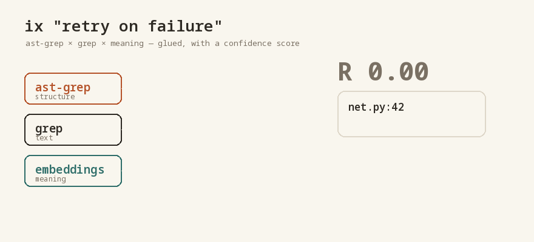

<!-- SPDX-License-Identifier: AGPL-3.0-or-later -->

# ix-search

### `ast-grep` × `grep` × meaning. Three searches, glued at one spot, with a confidence score.

```bash
# pip install ix-search — coming to PyPI; this works today:
pip install git+https://github.com/Intuition-Labs-LLC/ix-search
ix "the part that retries on failure"
```



That's the whole thing. You already know **`ast-grep`** (structure) and **`grep`** (text). `ix` runs both — **plus** a meaning search — glues the three at the same place, and gives every hit an **`R`**: how sure it is, *because they agreed.*

```
ix · structure ⊗ text ⊗ meaning, glued by R

  R 1.00  net.py:42    def retry_with_backoff(...)    [ast-grep·grep·meaning]   ← all three agree
  R 0.51  http.py:88   except ConnectionError: ...    [grep·meaning]            ← two agree
  R 0.26  util.py:12   # exponential backoff helper   [meaning]                 ← a stretch, flagged
```

**`R = 1`** when ast-grep, grep, *and* meaning land on the same line. Lower when only some do. It's confidence from agreement — not a black-box cosine.

## Zero effort

- **No API key, no GPU, nothing leaves your machine.** Meaning runs on [model2vec](https://github.com/MinishLab/model2vec) static embeddings (~30 MB, CPU).
- **For an agent:** `ix "..." --json` → `{path, line, R, agreed}` per hit, so it acts on confidence (take `R ≈ 1`, escalate `R < 1`) instead of guessing.

```python
from ix_search import search
for h in search("retry on failure", "."):
    print(h.R, h.path, h.line, h.agreed)
```

## Why it's more than grep

- **Three readings glue.** Lexical, structural, and semantic search are three views of one location; `ix` overlays them and scores the agreement. The hit where all three land is the one you want — and the semantic-only stretch is flagged, not hidden.
- **Matryoshka = speed.** The embeddings are nested (a prefix is a smaller embedding), so `ix` does a fast coarse pass on a truncated vector, then unfolds to full dim only on the survivors. (`--dim` tunes it.)

## The idea behind it

`ix` is the runnable instance of **The Matryoshka Sheaf** — local readings glue into one global result exactly when they agree, with `R = exp(−d_tail/scale)` as the gluing obstruction.

- 📄 Paper + code: <https://huggingface.co/datasets/intuitionlabs/matryoshka-sheaf>
- 🧩 ELI5: <https://intuitionlabs.tech/codebox/phi/35-the-matryoshka-sheaf>

Needs [`ast-grep`](https://ast-grep.github.io) and [`ripgrep`](https://github.com/BurntSushi/ripgrep) on `PATH` (the meaning search works without them).

---

AGPL-3.0-or-later · [Intuition Labs](https://intuitionlabs.tech)
